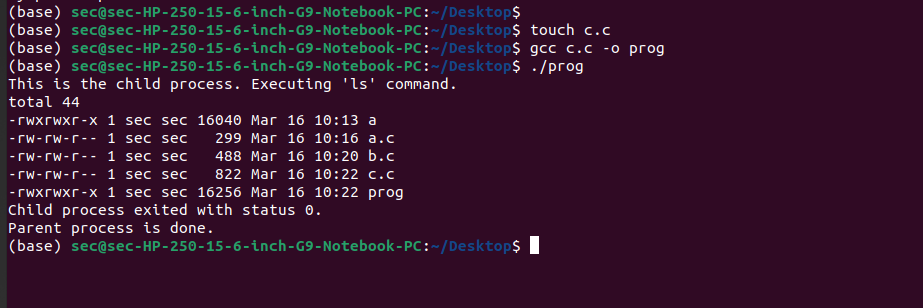

# Linux-Process-API-fork-wait-exec-
Ex02-Linux Process API-fork(), wait(), exec()
# Ex02-OS-Linux-Process API - fork(), wait(), exec()
Operating systems Lab exercise
# AIM:
To write C Program that uses Linux Process API - fork(), wait(), exec()
# DESIGN STEPS:
### Step 1:
Navigate to any Linux environment installed on the system or installed inside a virtual environment like virtual box/vmware or online linux JSLinux (https://bellard.org/jslinux/vm.html?url=alpine-x86.cfg&mem=192) or docker.
### Step 2:
Write the C Program using Linux Process API - fork(), wait(), exec()
### Step 3:
Test the C Program for the desired output. 
# PROGRAM:
## C Program to print process ID and parent Process ID using Linux API system calls
```
#include <stdio.h>
#include <sys/types.h>
#include <unistd.h>
int main(void)
{	//variable to store calling function's process id
	pid_t process_id;
	//variable to store parent function's process id
	pid_t p_process_id;
	//getpid() - will return process id of calling function
	process_id = getpid();
	//getppid() - will return process id of parent function
	p_process_id = getppid();
	//printing the process ids

//printing the process ids
	printf("The process id: %d\n",process_id);
	printf("The process id of parent function: %d\n",p_process_id);
	return 0; }
```

## OUTPUT

## C Program to create new process using Linux API system calls fork() and exit()
```
#include <stdio.h>
#include <stdlib.h>
#include <unistd.h>
int main() {
    int pid;
    pid = fork();
    if (pid == -1) {
        perror("fork");
        exit(EXIT_FAILURE);
    }
    else if (pid == 0) {
        printf("I am child, my pid is %d\n", getpid());
        printf("My parent pid is: %d\n", getppid());
        exit(EXIT_SUCCESS);
    }
    else {
        printf("I am parent, my pid is %d\n", getpid());
        sleep(100);
        exit(EXIT_SUCCESS);
    }
    return 0;
}
```
## OUTPUT

## C Program to execute Linux system commands using Linux API system calls exec() family
```
#include <stdio.h>
#include <stdlib.h>
#include <sys/types.h>
#include <sys/wait.h>
#include <unistd.h>
int main() {
    pid_t pid = fork();
    if (pid < 0) {
        perror("Fork failed");
        exit(EXIT_FAILURE);
    } else if (pid == 0) {
        printf("This is the child process. Executing 'ls' command.\n");
        execl("/bin/ls", "ls", "-l", NULL); // Lists files in long format
        perror("execl failed");
        exit(EXIT_FAILURE);
    } else {
        int status;
        waitpid(pid, &status, 0); // Wait for the child to finish
        if (WIFEXITED(status)) {
            printf("Child process exited with status %d.\n", WEXITSTATUS(status));
        } else {
            printf("Child process did not exit normally.\n");
        }
        printf("Parent process is done.\n");
    }
    return 0;
}
```
## OUTPUT

# RESULT:
The programs are executed successfully.
